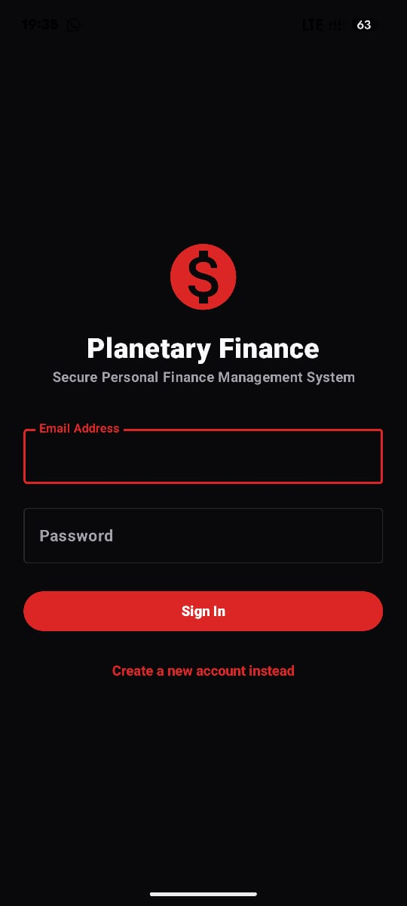
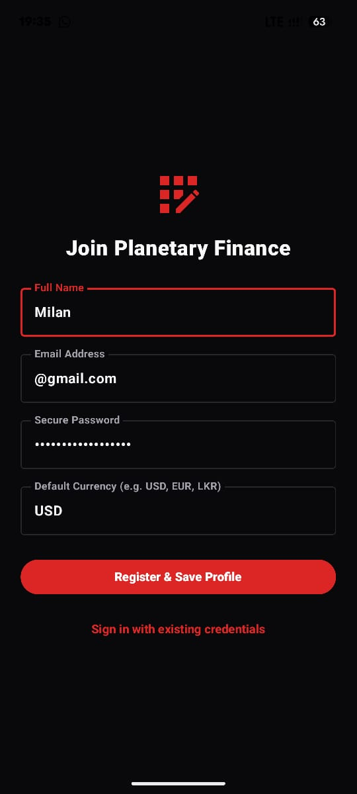
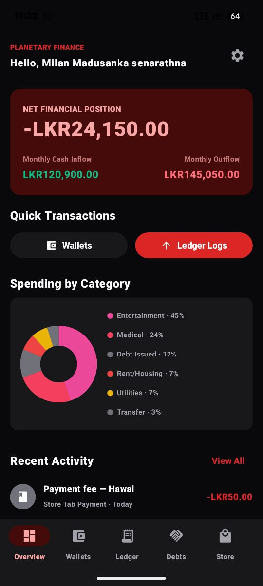
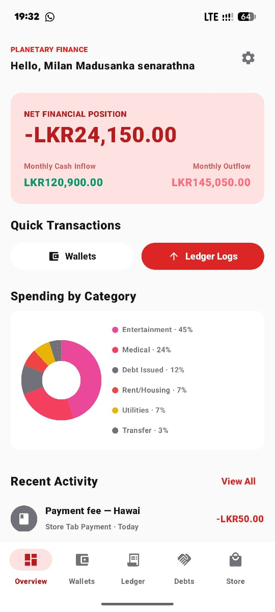
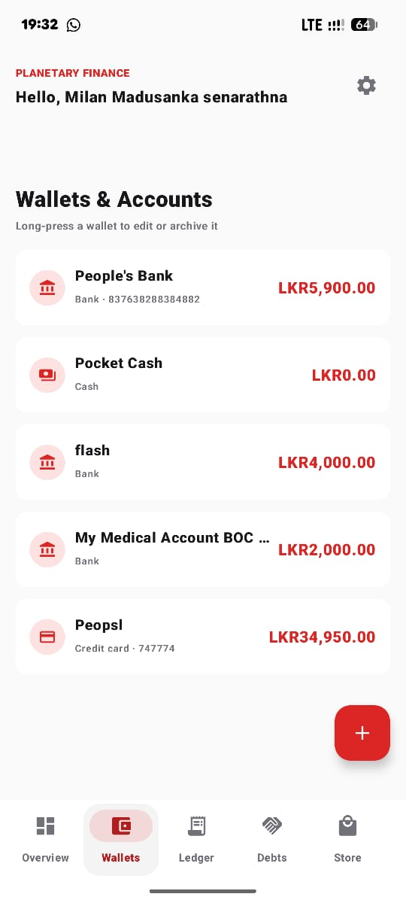
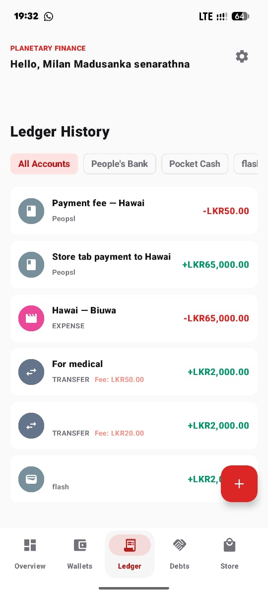
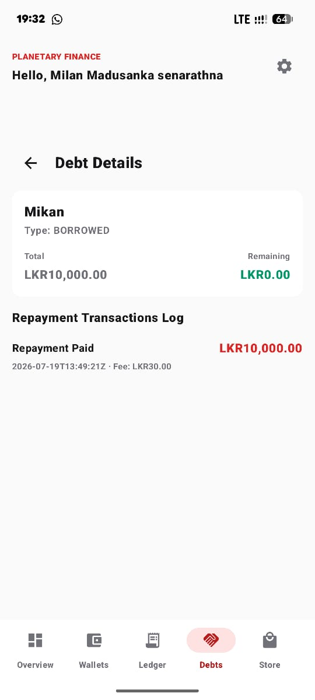
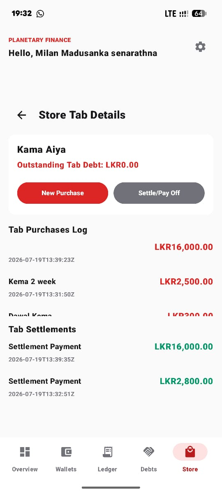
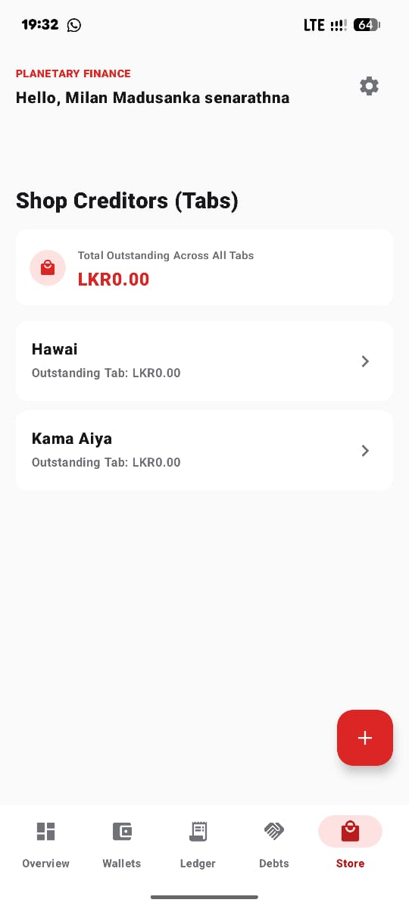
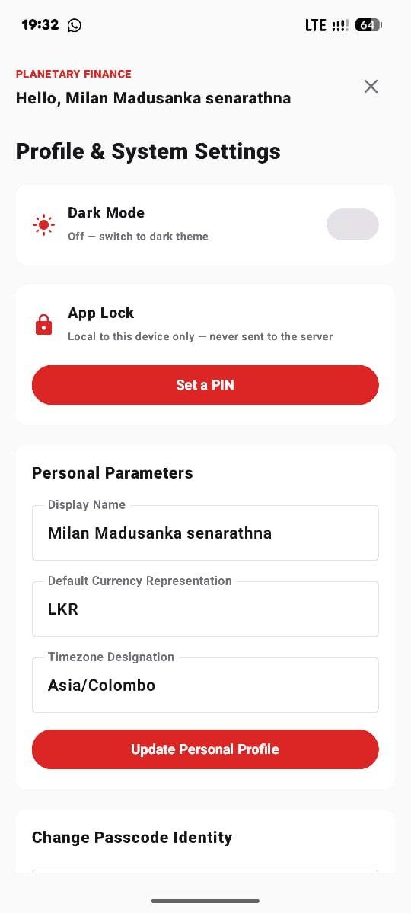

# Planetary Finance — Mobile

Native Android client for a personal finance app, built with Kotlin and Jetpack Compose. Talks directly to the [Go backend](https://github.com/milanz247/2026-expense-tracker-backend) — there is no local database; every screen is a live view of the same data the [web dashboard](https://github.com/milanz247/2026-expense-tracker-frontend) shows.

Part of a three-repo project:
- [expense-tracker-frontend](https://github.com/milanz247/2026-expense-tracker-frontend) — Next.js web client
- [expense-tracker-backend](https://github.com/milanz247/2026-expense-tracker-backend) — Go REST API
- **expense-tracker-mobile** (this repo)

## Screenshots

<table>
<tr>
<td></td>
<td></td>
<td></td>
<td></td>
</tr>
<tr>
<td align="center">Login</td>
<td align="center">Register</td>
<td align="center">Dashboard — dark</td>
<td align="center">Dashboard — light</td>
</tr>
<tr>
<td></td>
<td></td>
<td></td>
<td></td>
</tr>
<tr>
<td align="center">Wallets</td>
<td align="center">Ledger</td>
<td align="center">Debt details</td>
<td align="center">Store tab details</td>
</tr>
<tr>
<td></td>
<td></td>
</tr>
<tr>
<td align="center">Store tabs</td>
<td align="center">Settings — theme &amp; app lock</td>
</tr>
</table>

## Features

- Email/password auth against the Go backend's JWT endpoints — the session token is the only thing cached on-device (DataStore), never a copy of the data itself
- **Wallets**: bank / cash / credit card / investment, with optional branch, account number, and holder name for non-cash accounts; long-press a wallet to edit or archive it
- **Ledger**: income, expense, and transfer transactions, filterable by wallet, with fee support and category dropdowns (icon + color)
- **Debts**: money lent or borrowed, partial/full repayments with fee support, Total Receivables / Total Payables summary
- **Store tabs**: running credit at local shops — purchases now, settle later, with a total-outstanding summary across every shop
- **Reports**: income/expense/net with trend, 7-month cash flow, category breakdown donut chart, CSV/PDF export generated server-side and shared via the Android share sheet
- **Categories**: its own screen — add/delete, grouped by income/expense, each with an icon and color
- Light/dark theme toggle (persisted on-device), mirroring the web app's own neutral palette with a red accent
- **App lock**: optional PIN and fingerprint (BiometricPrompt) gate on reopening the app — entirely local, the PIN and biometric match never leave the device or reach the backend

## Stack

Kotlin · Jetpack Compose · Material 3 · MVVM (ViewModel + StateFlow) · Retrofit + OkHttp + Moshi · DataStore Preferences · AndroidX Biometric

No Room, no local database — `FinanceRepository` holds in-memory `StateFlow`s populated straight from the API and re-fetched after every mutation.

## Structure

```
app/src/main/java/com/example/
  data/            # Retrofit API service + DTOs, FinanceRepository, models
  ui/               # Screens.kt (all composables), ViewModels.kt
  ui/theme/         # Light/dark color tokens (Palette.kt, Theme.kt)
  MainActivity.kt   # Navigation shell, app-lock gate, biometric prompt
```

## Getting started

**Prerequisites:** [Android Studio](https://developer.android.com/studio)

1. Open this directory in Android Studio and let it sync.
2. Point the app at your backend by editing the `API_BASE_URL` field in `app/build.gradle.kts`:
   ```kotlin
   buildConfigField("String", "API_BASE_URL", "\"https://your-backend/api/v1/\"")
   ```
3. Run on an emulator or physical device.

Requires a running instance of [expense-tracker-backend](https://github.com/milanz247/2026-expense-tracker-backend) — register a new account from the app itself, no seed data needed.
